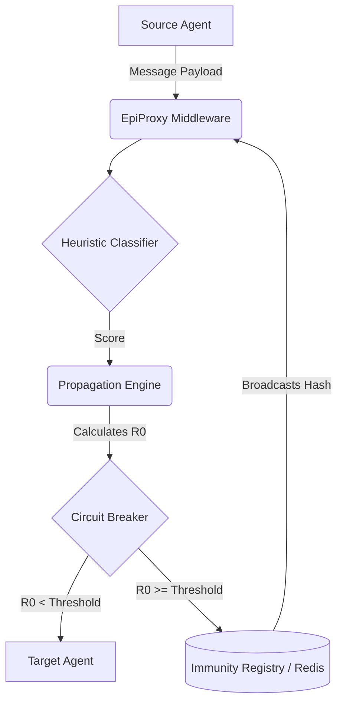

<div align="center">

# 🛡️ EpiProxy

**Agentic Proxy with Epidemiological Propagation Control for Multi-Agent LLM Swarms**

[](https://openjdk.org/)
[](LICENSE)
[](https://www.docker.com/)
[](https://github.com/codewithyug06/EpiProxy/actions)

</div>

## 📖 Table of Contents
- [The Problem](#-the-problem)
- [What is EpiProxy?](#-what-is-epiproxy)
- [Methodology](#-methodology)
- [Architecture & Workflow](#-architecture--workflow)
- [Key Components](#-key-components)
- [Installation & Setup](#-installation--setup)
- [Usage Example](#-usage-example)
- [Configuration](#-configuration)
- [Project Skeleton](#-project-skeleton)
- [Testing](#-testing)
- [Evaluation Plan](#-evaluation-plan)
- [Contributing](#-contributing)

---

## 🚨 The Problem

As autonomous AI agents evolve from isolated chatbots into interconnected, multi-agent "swarms" (using frameworks like LangGraph, AutoGen, or CrewAI), a new security vulnerability emerges: **Agentic Contagion**.

When one agent in a swarm is compromised (e.g., via prompt injection from a malicious user input or an untrusted web page), it can pass that malicious payload to other agents. Because agents inherently trust one another to collaborate, a single injection can rapidly propagate through the entire swarm, compromising multiple systems, escalating privileges, and exfiltrating data. Traditional Web Application Firewalls (WAFs) are blind to agent-to-agent communication.

## 💡 What is EpiProxy?

**EpiProxy** is a production-grade Java middleware for multi-agent LLM systems. It acts as an **AI-Native Immune System**, inspecting agent-to-agent messages and shutting down malicious propagation before it spreads.

**Useful For:**
- Securing enterprise LangGraph, CrewAI, or AutoGen-style agent swarms (via a language-agnostic interception point).
- Preventing indirect prompt injections from spreading laterally.
- Providing centralized observability and circuit breaking for agentic workflows.
- Researching epidemiological spread of malware in LLM topologies.

---

## 🔬 Methodology

EpiProxy applies **epidemiological models (specifically the basic reproduction number, R0)** to cybersecurity.

Instead of treating every message as an isolated event, EpiProxy evaluates the risk of a payload spreading based on the topology of the swarm:
- **R0 Calculation:** `R0 = classifierScore × trustWeight(targetTier) × max(1, downstreamFanOut)`
- If the heuristic score of a payload (maliciousness), weighted by the target agent's trust tier and multiplied by its downstream fan-out, meets or exceeds a configurable threshold, the system trips a **Circuit Breaker** and quarantines the source agent for a configurable TTL.
- The compromised payload's signature is hashed and broadcast to a Redis-backed **Immunity Registry**, "vaccinating" every proxy instance in the swarm against the same attack vector, with the signature set itself bounded by TTL and a max size.

---

## 🏗️ Architecture & Workflow



### 🔄 Workflow

1. **Interception**: Agent A attempts to send a message to Agent B through `SwarmProxy.intercept()` / `.aintercept()`.
2. **Quarantine Check**: EpiProxy checks the Redis-backed circuit breaker. If the source agent is already quarantined, execution is blocked immediately (`QuarantineReason.AGENT_ALREADY_QUARANTINED`).
3. **Immunity Check**: The payload's SHA-256 signature is checked against the immunity registry. A known-bad signature blocks immediately (`QuarantineReason.IMMUNITY_SIGNATURE_BLOCKED`).
4. **Scoring**: The payload is scored by the `HeuristicClassifier` (regex fast-path, then MiniLM embedding cosine similarity; results are cached).
5. **Epidemiological Math**: The `PropagationEngine` calculates the R0 risk factor using the swarm's DAG topology.
6. **Circuit Breaking**: If R0 exceeds the safety threshold, the message is dropped, a `QuarantineException` (`QuarantineReason.R0_THRESHOLD_TRIPPED`) is thrown, and the source agent is quarantined for `EPIPROXY_QUARANTINE_TTL_SECONDS`.
7. **Immune Broadcast**: The payload hash is broadcast via Redis pub/sub and added to the immunity registry.

---

## 🧩 Key Components

All under `com.epiproxy.*`:

- **`proxy.SwarmProxy`** — the core middleware orchestrating interception (`intercept`, `aintercept`, `wrapExecution`). Implements `AutoCloseable`.
- **`classifier.HeuristicClassifier`** — regex + MiniLM-embedding-based injection detection, with a bounded Caffeine cache and a dedicated executor for async scoring.
- **`propagation.AgentDAG`** — tracks agent message topology (JGraphT), bounded and pruned by TTL/max-size.
- **`propagation.PropagationEngine`** — the R0 math engine, with configurable trust-tier weights.
- **`circuitbreaker.CircuitBreaker`** — Redis-backed (with local fallback) agent quarantine with TTL auto-expiry and manual `clearQuarantine`.
- **`immunity.ImmunityRegistry`** — Redis-backed (with local fallback) signature registry, bounded by TTL and max size, broadcast via pub/sub.
- **`config.EpiProxyConfig`** — environment-driven configuration with a `Builder` for explicit/test construction.
- **`exceptions.QuarantineException`** — carries a `QuarantineReason` enum so callers can branch on cause instead of parsing messages.

---

## 🚀 Installation & Setup

### Prerequisites
- Java 17+
- Maven 3.8+
- Docker & Docker Compose (for Redis)

### 1. Clone & Build
```bash
git clone https://github.com/codewithyug06/EpiProxy.git
cd EpiProxy
mvn -q package
```

### 2. Environment Configuration
```bash
cp .env.example .env
```
Every key has a sane default (see [Configuration](#-configuration)); `.env` is optional for local development.

### 3. Start Redis
```bash
docker compose up -d
```

### 4. Run the demo
```bash
java -jar target/epiproxy-0.1.0-SNAPSHOT.jar
```

---

## 💻 Usage Example

```java
try (SwarmProxy proxy = new SwarmProxy(EpiProxyConfig.getInstance())) {
    // Define swarm topology for R0 calculation
    proxy.getDag().addMessage("researcher_agent", "writer_agent");
    proxy.getDag().addMessage("writer_agent", "publisher_agent");

    AgentMessage message = new AgentMessage(
            "researcher_agent", "writer_agent",
            "Here is a summary of the latest research findings.", 2);

    try {
        InterceptResult result = proxy.intercept(message);
        System.out.println("Allowed: " + result);
    } catch (QuarantineException e) {
        System.out.println("Blocked [" + e.getReason() + "]: " + e.getMessage());
    }
}
```

See `src/main/java/com/epiproxy/Main.java` for a complete runnable example, including the async `aintercept()` path.

---

## ⚙️ Configuration

All keys are read from `EPIPROXY_*` environment variables (or `.env`), with the defaults below. Invalid values are logged and replaced with the default rather than crashing the process.

| Key | Default | Purpose |
|---|---|---|
| `EPIPROXY_REDIS_URL` | `redis://localhost:6379` | Redis connection string |
| `EPIPROXY_REDIS_CONNECT_TIMEOUT_MS` | `2000` | Redis connect timeout |
| `EPIPROXY_REDIS_COMMAND_TIMEOUT_MS` | `2000` | Redis command timeout |
| `EPIPROXY_ML_MODEL_NAME` | `all-MiniLM-L6-v2` | Embedding model name (only MiniLM is bundled) |
| `EPIPROXY_HEURISTIC_THRESHOLD` | `0.3` | Classifier score threshold (informational; scores are always computed) |
| `EPIPROXY_CLASSIFIER_TIMEOUT_SECONDS` | `10.0` | Timeout for async classification |
| `EPIPROXY_CLASSIFIER_CACHE_SIZE` | `10000` | Max cached payload scores |
| `EPIPROXY_CLASSIFIER_EXECUTOR_THREADS` | number of CPUs | Threads for async classification |
| `EPIPROXY_TIMEOUT_FALLBACK_SCORE` | `1.0` | Score applied if classification times out (conservative: treated as risky) |
| `EPIPROXY_CIRCUIT_BREAKER_THRESHOLD` | `1.0` | R0 threshold that trips quarantine |
| `EPIPROXY_QUARANTINE_TTL_SECONDS` | `3600` | How long a quarantine lasts before auto-clearing |
| `EPIPROXY_IMMUNITY_SIGNATURE_TTL_SECONDS` | `86400` | How long an immunity signature is remembered |
| `EPIPROXY_IMMUNITY_SIGNATURE_CAP` | `100000` | Max signatures retained (oldest trimmed first) |
| `EPIPROXY_DAG_MAX_AGENTS` | `50000` | Max tracked agents before stale pruning kicks in |
| `EPIPROXY_DAG_TTL_SECONDS` | `86400` | Age at which an untouched agent is pruned |
| `EPIPROXY_TRUST_WEIGHTS` | `0.0,0.2,0.5,0.9` | Comma-separated trust weight per tier (0-3) |
| `EPIPROXY_LOG_LEVEL` | `INFO` | `com.epiproxy` logger level |

---

## 📂 Project Skeleton

```text
EpiProxy/
├── .github/workflows/       # CI/CD pipeline (GitHub Actions, Maven)
├── src/main/java/com/epiproxy/
│   ├── Main.java             # Runnable demo entrypoint
│   ├── circuitbreaker/       # Redis-backed agent quarantine
│   ├── classifier/           # Regex + embedding injection detection
│   ├── config/                # EpiProxyConfig (env-driven, builder for tests)
│   ├── exceptions/           # QuarantineException + QuarantineReason
│   ├── immunity/              # Redis-backed signature registry
│   ├── internal/              # Shared internals (Redis client factory)
│   ├── models/                 # AgentMessage, InterceptResult
│   ├── propagation/            # AgentDAG + PropagationEngine (R0 math)
│   └── proxy/                  # SwarmProxy middleware
├── src/main/resources/logback.xml
├── src/test/java/com/epiproxy/    # Unit tests (mocked) + integration test (@Tag("integration"))
├── docker-compose.yml         # Local Redis
├── pom.xml                    # Maven build (shade plugin produces a runnable fat jar)
└── README.md
```

---

## 🧪 Testing

```bash
# Fast unit tests (mocked Redis/classifier via Mockito; no live Redis needed)
mvn test

# Full integration suite (requires Redis: docker compose up -d)
mvn test -Dgroups=integration
```

---

## 📊 Evaluation Plan

1. **Latency Profiling**: Benchmark the classifier cache hit path and cold ONNX inference path (target: <50ms for cached messages, <200ms for raw inference).
2. **False Positive Rate (FPR)**: Run the `HeuristicClassifier` against benign agentic reasoning traces to ensure legitimate instructions aren't flagged.
3. **Propagation Containment Rate**: Simulate a 50-node agent swarm and inject payloads; measure how many agents receive a payload before the circuit breaker trips.
4. **Resilience Testing**: Kill Redis mid-run and confirm the local fallback paths in `CircuitBreaker`/`ImmunityRegistry` keep the proxy operational (with logged, per-instance-only degraded protection).

---

## 🤝 Contributing

Contributions are welcome! Please ensure that:
1. `mvn test` passes (fast unit tests).
2. `mvn test -Dgroups=integration` passes against a local Redis for any change touching `CircuitBreaker`/`ImmunityRegistry`/`SwarmProxy`.
3. New environment variables are added to both `EpiProxyConfig` and `.env.example`.

---

## 📜 License

This project is licensed under the MIT License - see [LICENSE](LICENSE) for details.
