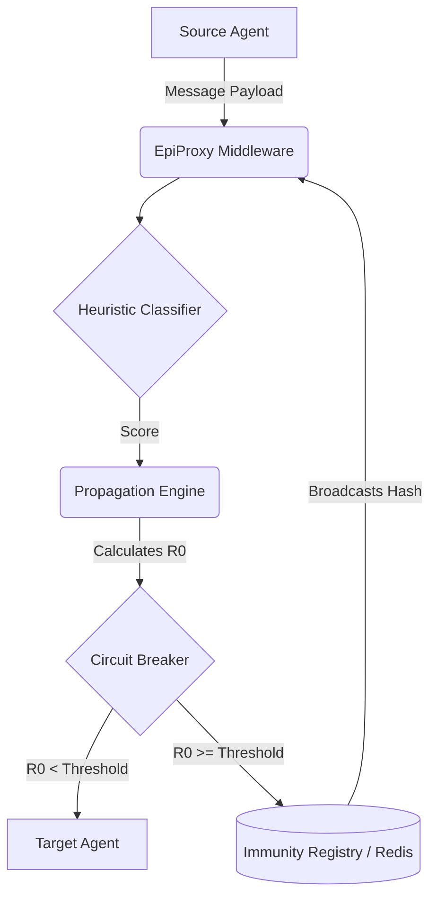

<div align="center">
  
# 🛡️ EpiProxy

**Agentic Proxy with Epidemiological Propagation Control for Multi-Agent LLM Swarms**

[](https://www.python.org/)
[](https://opensource.org/licenses/MIT)
[](https://www.docker.com/)
[](https://github.com/codewithyug06/EpiProxy/actions)

</div>

## 📖 Table of Contents
- [The Problem](#-the-problem)
- [What is EpiProxy?](#-what-is-epiproxy)
- [Methodology](#-methodology)
- [Architecture & Workflow](#-architecture--workflow)
- [Key Components](#-key-components)
- [Installation & Setup](#-installation--setup)
- [Usage Example (LangGraph)](#-usage-example-langgraph)
- [Project Skeleton](#-project-skeleton)
- [Evaluation Plan](#-evaluation-plan)
- [Contributing](#-contributing)

---

## 🚨 The Problem

As autonomous AI agents evolve from isolated chatbots into interconnected, multi-agent "swarms" (using frameworks like LangGraph, AutoGen, or CrewAI), a new security vulnerability emerges: **Agentic Contagion**.

When one agent in a swarm is compromised (e.g., via prompt injection from a malicious user input or an untrusted web page), it can pass that malicious payload to other agents. Because agents inherently trust one another to collaborate, a single injection can rapidly propagate through the entire swarm, compromising multiple systems, escalating privileges, and exfiltrating data. Traditional Web Application Firewalls (WAFs) are blind to agent-to-agent communication.

## 💡 What is EpiProxy?

**EpiProxy** is a production-grade middleware proxy designed specifically for multi-agent LLM systems. It acts as an **AI-Native Immune System**, inspecting agent-to-agent messages and shutting down malicious propagation before it spreads.

**Useful For:**
- Securing enterprise LangGraph, CrewAI, or AutoGen swarms.
- Preventing indirect prompt injections from spreading laterally.
- Providing centralized observability and circuit breaking for agentic workflows.
- Researching epidemiological spread of malware in LLM topologies.

---

## 🔬 Methodology

EpiProxy applies **Epidemiological models (specifically the basic reproduction number, $R_0$)** to cybersecurity. 

Instead of treating every message as an isolated event, EpiProxy evaluates the risk of a payload spreading based on the topology of the swarm:
- **$R_0$ Calculation:** $R_0 = (Score) \times (Fan-out) \times (Trust\ Tier)$
- If the heuristic score of a payload (maliciousness), multiplied by the source agent's fan-out (how many other agents it can talk to), multiplied by the target agent's trust tier (privilege level) exceeds a dynamic threshold, the system trips a **Circuit Breaker**.
- The compromised payload's signature is then hashed and broadcasted to an **Immunity Registry** (Redis-backed), "vaccinating" all other agents in the swarm against the same attack vector instantly.

---

## 🏗️ Architecture & Workflow



### 🔄 Workflow

1. **Interception**: Agent A attempts to send a message to Agent B. The framework (e.g., LangGraph) wraps this execution through `EpiProxy.intercept()`.
2. **Quarantine Check**: EpiProxy checks the Redis Immunity Registry. If the source agent is already quarantined, or the payload hash is recognized as a known threat, the execution is blocked immediately.
3. **Async Scoring**: The payload is scored asynchronously by the `HeuristicClassifier` (utilizing a cached SentenceTransformer model).
4. **Epidemiological Math**: The `PropagationEngine` calculates the $R_0$ risk factor using the swarm's DAG (Directed Acyclic Graph) topology.
5. **Circuit Breaking**: If $R_0$ exceeds the safety threshold, the message is dropped, an exception is raised, and the `CircuitBreaker` marks the source agent as compromised.
6. **Immune Broadcast**: The exact payload hash is broadcasted via Redis Pub/Sub, vaccinating the rest of the swarm.

---

## 🧩 Key Components

- **`SwarmProxy`**: The core `asynccontextmanager` middleware that orchestrates the flow.
- **`HeuristicClassifier`**: Leverages Regex and `all-MiniLM-L6-v2` SentenceTransformers to detect prompt injections. Runs in a non-blocking `asyncio.to_thread` pool with `@alru_cache`.
- **`AgentDAG`**: Maps the connections between agents to calculate fan-out potential.
- **`PropagationEngine`**: The core epidemiological math engine determining $R_0$.
- **`CircuitBreaker`**: Stateful module that tracks and quarantines compromised agents.
- **`ImmunityRegistry`**: Redis-backed shared memory to store payload signatures and broadcast threats across horizontally scaled environments.

---

## 🚀 Installation & Setup

### Prerequisites
- Python 3.10+
- Docker & Docker Compose (for Redis)

### 1. Clone & Install
```bash
git clone https://github.com/codewithyug06/EpiProxy.git
cd EpiProxy
pip install -e .
```

### 2. Environment Configuration
Create a `.env` file from the example:
```bash
cp .env.example .env
```
Ensure your configuration points to the correct Redis instance.

### 3. Start Redis Infrastructure
```bash
docker compose up -d
```
*Note: EpiProxy ships with a secure Redis configuration requiring a password and enforcing memory limits.*

---

## 💻 Usage Example (LangGraph)

EpiProxy provides a seamless wrapper for LangGraph nodes.

```python
from langgraph.graph import StateGraph
from epiproxy.proxy.middleware import SwarmProxy
from epiproxy.integrations.langgraph import wrap_node

# Initialize the proxy
proxy = SwarmProxy()

# Define swarm topology for R0 calculation
proxy.dag.add_message("researcher_agent", "writer_agent")
proxy.dag.add_message("writer_agent", "publisher_agent")

# Wrap your existing LangGraph nodes
secure_writer = wrap_node(
    node_func=your_writer_node, 
    proxy=proxy, 
    source_agent="researcher_agent", 
    target_agent="writer_agent", 
    trust_tier=2
)

# Build the graph
builder = StateGraph(AgentState)
builder.add_node("researcher_agent", researcher_node)
builder.add_node("writer_agent", secure_writer)
```

---

## 📂 Project Skeleton

```text
EpiProxy/
├── .github/workflows/       # CI/CD pipelines (GitHub Actions)
├── epiproxy/                # Core library source code
│   ├── circuit_breaker/     # Quarantines compromised agents
│   ├── classifier/          # ML/Regex injection detection
│   ├── immunity/            # Redis-backed signature registry
│   ├── integrations/        # Framework wrappers (LangGraph)
│   ├── propagation/         # DAG mapping and R0 mathematics
│   ├── proxy/               # Main SwarmProxy middleware
│   └── config.py            # Pydantic Settings management
├── tests/                   # Pytest integration & E2E tests
├── docker-compose.yml       # Secure Redis infrastructure
├── pyproject.toml           # Dependencies & package config
└── README.md                # Project documentation
```

---

## 📊 Evaluation Plan

To ensure EpiProxy remains robust against emerging threats, the evaluation plan involves:

1. **Latency Profiling**: Benchmarking the async `@alru_cache` and `asyncio.to_thread` mechanisms under load (target: <50ms overhead for cached messages, <200ms for raw inference).
2. **False Positive Rate (FPR)**: Running the `HeuristicClassifier` against standard agentic reasoning traces (e.g., ReAct logs, plan-and-solve outputs) to ensure benign analytical instructions aren't flagged as prompt injections.
3. **Propagation Containment Rate**: Simulating a 50-node agent swarm and injecting 10 payloads. Measuring the "infection radius" (how many agents receive the payload before the Circuit Breaker trips).
4. **Resilience Testing**: Injecting network partitions between the application and Redis to ensure local fallbacks (`self._local_fallback`) prevent widespread crashing.

---

## 🤝 Contributing

Contributions are welcome! Please ensure that:
1. You run `pip install -e .[dev]` to install testing dependencies.
2. All tests pass locally (`pytest tests/ -v`).
3. You follow the existing async context manager patterns when writing new framework integrations (e.g., CrewAI, AutoGen).

---

## 📜 License

This project is licensed under the MIT License - see the LICENSE file for details.
